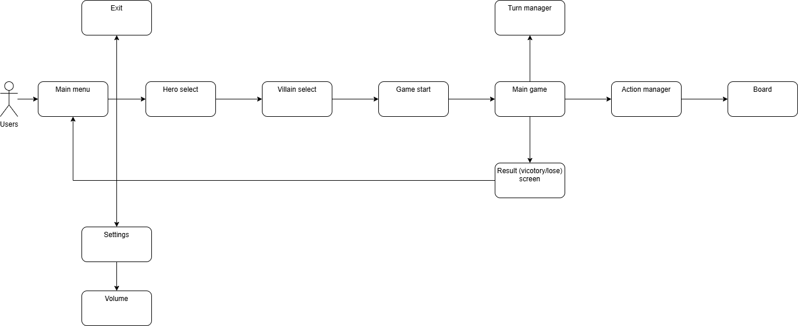

# Wymagania dla gry Marvel United w Unity

## 1. Wymagania funkcjonalne

### 🔹 Rozgrywka

- Gra przeznaczona dla 2-4 graczy, z każdym graczem kontrolującym jednego bohatera.
- Każdy bohater posiada talię 12 kart z unikalnymi kombinacjami akcji.
- Talia Zbira zawiera 12 kart **Knucia Aktywnego** oraz 6 kart **Knucia Lokacyjnego**.

#### System tur

- Gracze wykonują 3 tury, po czym Zbir zagrywa kartę.
- Po zakończeniu jednej misji: Zbir zagrywa kartę co 2 tury graczy.

#### System akcji

- Bohaterowie zagrywają karty, wykonując przypisane akcje: **ruch**, **atak**, **czyn heroiczny**, **wild**.
- Możliwość korzystania z efektów kart wcześniejszych graczy (storyline).
- Talia kart Zbira jest odczytywana sekwencyjnie – Zbir nie dobiera kart na rękę.
- Mechanika **BAM!** – Zbir aktywuje swoją zdolność specjalną, gdy karta ma ten efekt.

#### Mechanika Knucia Lokacyjnego:

- Każda lokacja na starcie gry otrzymuje losową kartę **Knucia Lokacyjnego**.
- Blokują one zdolności lokacji i wymagają spełnienia warunków, by je usunąć.

#### Mechanika „życia” bohaterów:

- Liczba kart na ręce = punkty życia.
- Jeśli bohater straci wszystkie karty, następuje **BAM!**.
- W kolejnej turze bohater dobiera 3 karty + 1 na start każdej tury.

#### Zwycięstwo i przegrana:

- **Zwycięstwo**: Bohaterowie wygrywają, jeśli pokonają Zbira, spełniając warunki zwycięstwa.
- **Przegrana**: Bohaterowie przegrywają, jeśli wyczerpią się karty w talii bohaterów i nie mogą dobrać na początku tury.

### 🔹 Plansza i lokacje

- Plansza składa się z 6 lokacji, każda z unikalną zdolnością, która może być zablokowana przez **Knucie Lokacyjne**.
- Lokacje mają limity cywili i zbirów – po przekroczeniu limitu następuje efekt **Przerażenia** (Overrun).
- Bohaterowie mogą przemieszczać się między sąsiednimi lokacjami w ramach akcji **Ruchu**.

### 🔹 UI i interakcja

- **Ekran startowy**: Nowa Gra, Opcje, Wyjście.
- **Ekran wyboru postaci i Zbira**: Podgląd postaci po lewej stronie oraz lista bohaterów po prawej.
- Interfejs gry zawiera:
  - Rękę aktywnego gracza na dole ekranu.
  - Liczbę pozostałych kart w talii bohatera.
  - Aktualny **storyline** (ostatnie 3 karty).
  - Karty Zbira i ich efekty.
  - Zablokowane postacie w wyborze postaci są wyszarzone i mają ikonę kłódki.
  - Animacje efektów **BAM!**, ataków i rozgrywania kart dla lepszego feedbacku.

### 🔹 System plików i dane

- Talie kart bohaterów i złoczyńców przechowywane są w plikach **JSON**.
- Pliki JSON zawierają:
  - ID karty, nazwę, symbole akcji, efekt specjalny (jeśli jest).
  - Informacje o odblokowanych postaciach przechowywane są w osobnym pliku JSON.

---

## 2. Wymagania niefunkcjonalne

### 🔹 Wydajność i optymalizacja

- Gra powinna działać płynnie w **60 FPS** na komputerach o średnich parametrach.
- Optymalizacja modeli 3D i animacji – plansza w 3D, postacie jako sprite’y lub modele 3D w stylu figurek.
- Minimalizacja czasu ładowania scen (np. szybkie przejścia między ekranami).

### 🔹 User Experience (UX)

- Intuicyjne sterowanie – interfejs przyjazny dla użytkownika, przejrzysty układ UI.
- Efekty wizualne i dźwiękowe – dźwięki dla akcji, **BAM!**, efektów specjalnych.

### 🔹 Skalowalność

- Możliwość dodania nowych bohaterów i złoczyńców poprzez edycję plików JSON bez ingerencji w kod.
- Możliwość dodania trybu **Heroicznego** (większa trudność, więcej kart BAM!).
- Możliwość implementacji trybu **solo** (1 gracz steruje kilkoma bohaterami).

### 🔹 Bezpieczeństwo i stabilność

- System zapisu postępów – odblokowane postacie powinny być zapisywane w pliku JSON.
- Unikanie błędów w turach – gra powinna wykrywać niepoprawne zagrania i zapobiegać ich wykonaniu.
- Testy AI Zbira – sprawdzenie, czy Zbir poprawnie wykorzystuje swoje efekty **BAM!** i **Knucia**.

### 🔹 Schemat architektury systemu gry

